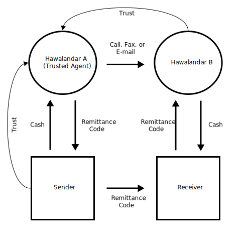
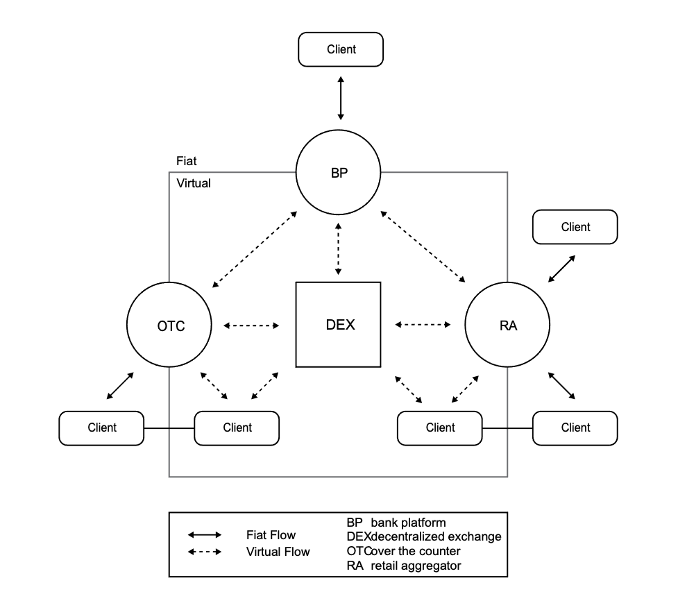

# Whitepaper

## Abstract

Onomy is a single collateral multi-stable coin protocol for virtual denominations of currencies, named Denoms, to support the foreign currency exchange marketplace. The Onomy protocol coin, abbreviated NOM, collateralizes each virtual currency denomination \(Denom\) minted through the Onomy Reserve \(ORES\). The base layer Onomy Exchange \(ONEX\) facilitates high-speed transactions between Denoms and NOM while also providing secure price discovery for collateral ratios and automated liquidations of ORES accounts. The Onomy Network \(ONET\) is built using a Proof of Stake implementation of an innovative concurrent byzantine consensus mechanism that utilizes rank aggregation to order all transactions fairly without byzantine leaders' interference. Participants secure and govern the ONET by staking and delegating validators with NOM and are rewarded with NOM for doing so. NOM that is not staked with or delegated to validators may be used to mint Denoms through the ORES.

## Introduction

By nature, FOREX is a decentralized marketplace that supersedes the regulatory bodies that issue and govern the denominations of currencies. Despite many technological advances, FOREX settlement risk remains significant according to the Triennial Central Bank Survey of Foreign Exchange and Over-The-Counter Derivatives Markets in 2019. An estimated $8.9 trillion of payments are subject to settlement risk on any given day. In the past, significant disruptions to markets have taken place when settlement risk materializes. 

In 1974, the bankruptcy of a German bank active in FX markets named Bankhaus Herstatt demonstrated how FX settlement risk can undermine financial stability. At 15:30 CET on June 26, 1974, the German authorities closed the bank down. While Herstatt had already received Deutsche marks from its counterparties, it had not yet made the corresponding US dollar payments in New York. Herstatt's failure to pay led banks more generally to stop outgoing payments until they were sure their countervalues had been received. The international payment system then froze, and the erosion of trust caused lending rates to spike and credit to be curtailed. Settlement risk continues to be a significant risk and has increased in both relative and absolute terms since 2013. \(Bech & Holden, 2019\)

We propose addressing Forex settlement risk and market fragmentation issues \(Schrimpf & Sushko, 2019\) through Onomy, a decentralized protocolthat virtualizes major currencies around the world and provides for near-instantaneous settlement. Recent advances in decentralized protocols and proven implementations of a new class of virtual-assets named stable-coins have made this possible.

Onomy consists of three pillars designed to be a self-governed monetary stabilization system.

* **ONET:** A decentralized peer-to-peer computational network that processes transactions submitted by users and rewards operators in 'ONET's native protocol coin NOM.  
* **ORES:** governs minting of stabilized virtual currencies, called Denoms, utilizing OMY as collateral.
* **ONEX:** a base-layer decentralized exchange that is used by Onomy participants to trade NOM and Denoms. ONEX is integrated with ORES to handle reserve accounts' liquidations and rebalance collateral ratios during times of distress. 

## Money

The year is 2021, yet it is very reminiscent of 1873, when Walter Bagehot wrote in his book, Lombard Street, that London's financial system during his time was the most extraordinary combination of economic power and economic delicacy that the world has ever seen. Ten years prior to writing his book, a firm known as the 'banker's bank named Overend, Gurney, and Co. lost all of its capital within a matter of six years, showing how fragile a system that relies on “long-established credit” can be. Within twenty years, the four great London Joint Stock Banks' liabilities had grown by a multiple of six while the private deposits of the Bank of England had only increased by a factor of two. He foresaw a reckoning where panic in the market could create a situation where a run on the Bank of England would cause insolvency, even being the “Lender of Last Resort.” Bagehot put forth mechanisms and a system that creates a strong foundation to base the financial markets. His solution's core pillar included a“Reserve Bank” that would lend based on strict collateral requirements, a fundamental piece to ORES.

Today, we see the unfolding of a similar scenario that Bagehot chronicled in his book within the currency markets. Starting with the secure yet slow, Bitcoin, virtual currencies have evolved to the point where fiat currencies are now being represented as hard and soft pegged stable-coins. In addition, Central Banks around the world look to digitize their currencies further using similar technologies. The unpegged virtual currency markets are volatile, and people look for risk-less virtual assets as safe havens to trade out of riskier assets. Collateralized stable-coins also allow leveraging of the underlying collateral.

This was much the same, albeit with gold and silver, across the world before the banking system, paper money, and securities were introduced in the western world. At that time, most people did not trust others with their silver or gold and stored it within their homes. A professional that had saved their bullion and coins had no way of deploying it into the economy in a secure manner. When notes began to be issued and offered an outlet for this capital, the East Indies Company, South Sea Company, as well as companies for all sorts of various endeavors, sprang up that only provided returns based on speculation versus realized production.

Similarly, virtual currency markets have gone through these cycles. The excess wealth created during the bull-run of 2016-17 in the virtual currency markets had nowhere to go. This capital, combined with the advent of the Ethereum ERC20 token, allowed many companies to issue blockchain tokens and sell them to investors. The triviality of creating a blockchain token married to the excess capital led to an influx of newly formed companies, illegitimate and legitimate.This also led to the proliferation of “stable-coins” that are parity-stabilized virtual currency representations of fiat currencies , primarily USD variants, as traders sought less volatile refuges. 

Stable coins help manage market volatility by incentivizing protocol participants to stabilize the virtual currency with its represented fiat. With the volatility risk of unpegged virtual currencies mitigated, stable coins are now poised to become normalized within society as a form of payment and store of value. Thus, we are at the cusp of a financial revolution the likes of which are more revolutionary than what Bagehot experienced and wrote about on Lombard Street. These stable coins will usher in the full-scale integration of the virtual world with the real world. The dawn of the virtual generation is here.

## Collateral

Before the advent of banking and paper money, collateral and money were one and the same. The coinage used as payment for goods and services was made of a particular species of metal that represented a value. By separating the money from the collateral, banks and governments realized that the paper money that represented the collateral in the reserve did not derive its value necessarily from the specie it represented, but the value of goods and services that it could obtain in the market economy. 

It is in only the “belief of value” that gold and other species of metal are considered collateral in the first place. There is no use for gold that would place it in a position that it is held as the world’s collateral other than its properties as a suitable vessel of collateral. Although, it is a good conductor it is its physical properties that make it a good store. It is durable, malleable, unreactive, and qualitatively shiny. Collateral only has value because it was endowed that status by the humans that use it. The recognition of wealth determined by those that hold much gold is only an illusion bestowed by all others that share the same belief in it value.

The collateral that backs decentralized virtual stable currencies is necessarily volatile virtual currencies. Their value as collateral, just as any other form of collateral, is endorsed by the market participants that as Adam Smith would say, drive the “Hand of God” through supply and demand. Although collateral seems to be a necessity for paper money to have value, when the world of finance dared separate money and collateral into two distinct forms, they found quite the opposite. The value of money, it would seem, is much more of a function of the flows within the currency market than it is the value of the underlying of the collateral or stocks of currencies. \(King, Osler, & Rime, 2011\)  Unhinged from their underlying collateral by loosening of the Gold Standard, while also being tamed by prudent economic policies, fiat currencies whom have favorable exchange rates have led to the greatest economies ever been seen.

What be of collateral other than a concrete formalization of belief, faith, and credit?  All collateral derives its value in currency, circularly it seems, from its ability to be exchanged for money or its ability to print money thereof. In the same vein, NOM, the protocol coin of Onomy, is defined as the underlying collateral to all Denoms. NOM derives its value from the ability, endowed by the Onomy Reserve, to generate stabilized virtual currencies. The belief, faith and credit of NOM are therefore derived from the network’s endowment of these permanent intrinsic properties. The strength of the Onomy’s ability to stabilize the Denoms with their representative fiat currencies and its properties endows NOM as a perfect collateral.

### Properties of NOM as Perfect Collateral

* **Malleable:** Ability to mint any denomination of a stablized virtual currency
* **Scarce:** Pre-defined release into circulating supply and burning of supply
* **Transferable:** Transactions on the Onomy Network finalize near instantaneously
* **Durable:** Secure decentralized system capable of self-stablizing from attacks
* **Verifiable:** Anonymous accounts are publicly verifiable on the network
* **Fair:** Transactions are ordered by which arrives at the most nodes first

Lastly, the Denoms are not only collateralized by NOM, but are also a vessel of collateralization of NOM. As mentioned before, the flows of currencies determine the exchange rate or value of a currency in terms of other currencies. The exchange rate, determined by the currency flows, is then in essence the evidence of a form of market collateralization. The ability for a currency to be exchanged for another is what backs fiat currencies not tied to gold as well as volatile cryptocurrencies that have no other underlying collateral. Therefore, if a Denom is stabilized with its counterpart fiat currency then itself becomes collateralized by the market. Thus the NOM itself is collateralized by the Denoms it has the ability to mint. As the Denoms market capitalization grows, whilst being stabilized with their fiat counterparts, the NOM is itself collateralized by the market as well while serving as the collateral for the market.

## Foreign Exchange

### Hawala

The first coins appeared in 600 B.C. created by Kin Alyattes in Lydia and the first paper money was introduced by the Chinese Tang Dynasty which ruled from 618 – 907 A.D. China had already gone through a financial crisis due to inflation and outlawed paper money entirely in 1455 A.D. before the western world had even had a taste of the financial instrument. Even though coins and paper money have significant utility within the economy they are limited to the jurisdiction of the issuing body. Therefore, other forms of remittance were formed to aid traders of foreign goods.

There are and continue to this to be forms of foreign remittance that pre-date and work along-side today’s formal banking and cross-country payment systems. The Tang Dynasty had a system to transfer funds named the fei-ch’ien \(flying money\). Also, by some accounts, the “hawala” system has existed since the 8th century as a vast network of money brokers that originated in India to serve Muslim, Arabic and Indian traders along the Silk Road and continues to operate today. Hawala is built on a network of trust and relationships between money tradesmen called hawalandars. These hawalandars are usually large distances from each other and rely on their counterparts to execute either simple or complex reverse informal hawala transactions to settle their positions. \(World Bank and IMF, 2003\)

### Current Forex Market

Trust is also the vital ingredient in the formal banking and foreign currency exchange systems. Settlement risk here has the potential to have catastrophic rippling effects throughout the global economy as trillions flow daily through various channels. Many of these transactions are not done through a secure system, such as Onomy or CLS, and are susceptible to disruption if any of the counterparties in the transactions fails to fulfill their obligation after the other party has paid.

The foreign currency market had been described as a partially-decentralized marketplace consists of inter-bank and retail sectors which has presented a challenge to those that wish to navigate or model them. \(Tuyls, Brandlhuber, Delage, & Weiss, 2011\) Large banks make up most of the transactions through trading channels and relationships that the public does not have access to, but with the advent of electronic trading considerable access have been given to many different actors playing a plethora of roles. The major categories of market participants now include asset manages, dealers, central banks, small individual \(retail\) traders, and high-frequency traders.

Because the FX markets are not regulated, there is reduced visibility and an amorphous structure also allows banks to take fees on both sides of retail transactions and control pricing information of trades. Vast inefficiencies in many parts of the world leave retail customers to bear high costs and subpar efficiency due to lack of economic incentive to build out relationships that garner the needed trust and infrastructure that provides accessibility.

Despite these inefficiencies, FX trading has evolved since exchange rates could float in the 1970’s. Initially, the telephone was used to communicate bid and ask quotes in the interdealer market. Squawk boxes, which were multi-party phone lines like today’s conference calls, were introduced to relay buy and sell pricing to multiple parties and are still used today in some emerging markets. With the introduction of electronic trading through the 1980’s and 1990’s, FX trading brought real-time pricing data and increased efficiency to the inter-dealer trade. Electronic trading has also brought FX retail trading to the PCs and laptops of many who otherwise would have been not been able to participate through retail aggregators. Algorithmic trading was introduced concurrently and by some estimates now accounts for one third to a half of all trades. \(King, Osler, & Rime, 2011\)

The number of actors within the FX market has steadily increased as accessibility has increased. The market also has become increasingly fragmented as secondary electronic platforms compete for customers. This fragmentation leads to arbitrage opportunities that high frequency algorithmic trading take advantage of leading to estimates of 30 - 50% of trading volume. The marketplace is split into the inter-dealer market and the customer market although those lines being blurred by the platforms that allow end-users to trade alongside the dealers themselves. Even though there is considerably more access and the market is fragmented, the market is still dominated by only three large dealers.

### Virtual Currency Market \(Cryptocurrency\)

There are many similarities between FOREX and virtual currency markets. The most obvious is that both markets are based on “currencies,” while some may not agree that they are not equivalent. In addition, both markets are decentralized by nature with complex structures. Lastly, many virtual currencies not only emulate fiat currency in their utility, but also have digital and social economies that have effects on the pricing like those of fiat currencies.

While the Forex markets have been maturing since the 1970’s, virtual currencies have only been in existence since 2009. Their origin and rise to prominence have been purely through trading with very little use outside of the financial markets themselves. As such, the value of virtual currencies has been primarily speculative in nature based on the short and long term investment as well as volatility trading.

The traditional on and off ramps from the fiat currencies to the virtual world have been either through retail aggregators, in the form of “cryptocurrency exchanges”, as well as OTC trades and brokers. Until recently, regulation has stopped banks from participating, but that has started to change with many banks setting up trading desks as well as accepting deposits. This opens up the doors to dual purpose banks that act as dealers in the Forex markets as well as dealers in virtual currencies.

While foreign currency markets are separated into Inter-dealer and customer service networks, virtual currencies are separated into fiat and virtual domains. Virtual currencies only exist within the virtual domain while fiat currencies flow primarily between three different actors; retail aggregators, OTC dealers and more recently bank platforms. Retail aggregators consists of virtual currency exchanges where retail trades take place while larger trade take place through OTC desks where there is concern that slippage may occur within illiquid markets. Bank platforms are emerging as regulators begin to authorize the first “crypto-banks” to be licensed.

Within the virtual domain flows are are highly interconnected between all parties with permissionless access to decentralized exchanges as well as other platforms. The network effects created by this interconnectedness is the primary advantage. Volatility, regulations, lack of infrastructure and limited on-ramps from fiat currency are restricting virtual currencies from use as main stream payment vehicle. The primary on-ramps are through retail aggregators as well as over the counter desks at those same retail aggregators.

### Forex & Crypto Market Integration

Stable-coin integration into Forex markets relies on the fiat interfaces within the cryptocurrency market to provide liquidity. The customer demand will come internally within the highly connected virtual domain where the main driver for adoption is is the need for less volatile instruments for value storage as well as ability to derive arbitrage opportunities. The secondary demand will be from Forex participants looking for on ramps into crypto from different denominations of fiat. These transactions will go through retail and OTC desks handling both forex and virtual currencies. Retail aggregators hosting virtual currency exchange platforms are also the leading virtual currency over the counter dealers.

### Denoms as Payment

As Denoms became a trusted substitute for their represented fiat currencies, further integration of the virtual with real world will take place. The main thing that the virtual world provides is accessibility and access. Both foreign exchange and virtual currency markets have shown are viral in nature. The flow for virtual currencies between customers then is specifically on the virtual domain. Virtual currencies will begin to overtake their represented fiat counterparts as the preferred form of payment. This due to the interconnected nature, peer 2 peer transactions and verifiable history. At that time, fiat currencies will become more of a collateral than method of payment. Dealers in forex will not only have access to real fiat currencies markets, but be able to convert fiat to virtual and virtual to fiat. Denoms will be minted and traded on Onomy with market sizes of specific Denoms growing and shrinking with the demand for exchange following trade winds. Banks that offer virtual and fiat services will takeover dealer roles and retail aggregators that offer fiat-pairs as well as fiat-fiat pairs will have a significant advantage over their counterparts serving only fiat or virtual. As the Mandalorian would say, “This is the way” to full-scale integration of the virtual with the real.

## Onomy Exchange \(ONEX\)

The ONEX bridges the gap between the largest market in the world, the exchange of foreign currencies, and the realm of virtual currencies. Some would argue that all currencies are now digital, and this is for the most part correct. What is missing from FOREX are the guarantees provided by virtual currencies such as accessibility, transparency, verifiability, riskless settlement, price discovery, accessibility and the codification of transfer. Combining the two gives the ability to address inefficiencies and limitations within both markets and will open opportunities to both large institutions as well as retail customers in a way that will enhance the lives of all people.

### Denom Stabilization

#### Core Principles

1. **Minimalism:** Institute only the necessary controls to stabilize Denoms
2. **Constraint:** Base-layer virtual currency stabilization protocol. No securities or contracts as defined by the SEC or CFTC.
3. **Closed Loop:** No outside oracles. All economic control requiring information derived outside information will be voted on by NOM holders.
4. **Separation of Concerns:** Network staking with ONET for security purposes is separate from the market stabilization of Denom.

#### **Levers of Denom Stabilization**

**Reserve Rate \(RR\):** The RR of Denoms mined by ORES is used to manage deviations from parity between Denom and its represented currency. The RR may apply both positively to inflate the currency, or negatively to deflate the associated currency to achieve parity.

**Denom Staking Rate \(DSR\):** The DSR dictates the inflation of Denoms staked at nodes. This is implemented to reward users for securing the network with Denoms, as well as control flows in and out of the market to stabilize currency with its represented fiat currency. The Denom staking rate will only be a positive rate.

**Minimum Collateralization Ratio \(MR\):** The MCR of Denom loans to the represnted currency is based on the ONEX trading pair price ratio. The principle amount of any Denom, plus any interest accured, based on the Reserve Rate will determine the collateralization ratio. When MCR is reached, the Reserve Account will not be allowed to mint any more Denoms. To re-enable the account, the account holder must deposit more NOM or the Denom that was loaned.

**Reserve Collaterization Ratio \(RCR\):** The RCR is used to manage volatility risk of NOM to Denom by building a reserve of NOM within the ORES. When a specific ORES account falls below the RCR, then the amount of NOM in the account equal to the market value of the specific Denom will be taken into the ORES Reserve Account. The Denom held within the ORES may be voted on by NOM holders to purchase Denoms from the market to stabilize peg during times of extreme distress.

**Collateral Liquidation Fee \(CLF\):** The collateral liquidation fee will be imposed upon any ORES accounts that are triggered for liquidation. After the balance of the Denoms is purchased with NOM in the defaulted account, an additional percentage of the NOM, determined by a vote of the NOM holders, will be deducted from the defaulted reserve balance before returning the account in good standing to the owner. NOM collected from CLF will be burned distributing the value to all NOM holders by reducing the supply in circulation.

Combined the controls give a simple, yet robust way to manage deviations from parity as well as collateral risks. Because Onomy is a single collateral multi stable coin protocol, each Denom will have its own unique RR to cope with fluctuating market conditions across the multiple represented currencies. Since MCR and RCR are managing collateralization risk, RCR is applied equally no matter the Denom or instrument backed by NOM generated by the ORES. All three controls are governed by staked node operators requiring no outside oracles for the system to function. Working groups will be established to suggest rates and build integrated services as part of the default node implementation based on market data feeds. Controls will then be voted on and decided through a Byzantine tolerant averaging algorithm.

## Staking

Primary network security of the ONET is assured through a Proof of Stake model through bonding of NOM to validators either by the validators themselves or by delegation. Because network security depends on the bonding to create both incentive for good behavior and disincentives for bad behavior, staked NOM will not be allowed to mint while staked, but will receive the staking rewards. Staking rewards are given based on a dual-regime model with an initial hyper-inflationary period defined by an inflation vs cumulative reward hyperbolic decline curve followed by an indefinite stabilization period with a goal of 50% of NOM staked with nodes. 

Secondary network security mechanism is assured through the bonding of Denoms to validators either directly or by delegation. Bonded Denoms will receive a reward based on the DSR \(Denom Staking Rate\) for each particular Denom.

