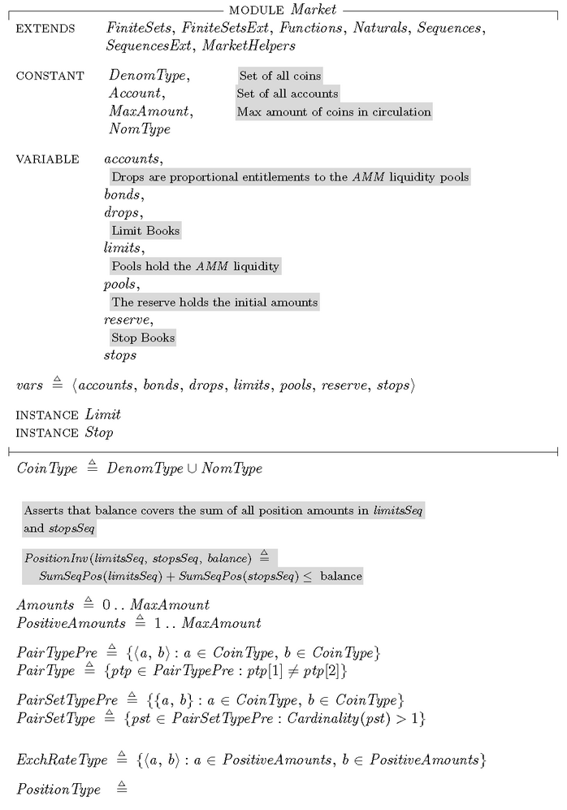

# Onomy Reserve

Onomy Protocol aims to facilitate on-chain Forex trading, payments, settlement, remittance, diversification, and DeFi access through decentralized, crypto-collateralized, and non-custodial stablecoins pegged to the value of major world currencies like the USD, EUR, JPY, CHF, CAD, and others.

This is achieved through the Onomy Reserve - by [over-collateralizing each stablecoin minted](https://docs.onomy.io/founding-philosophy/stablecoins-and-collateral) and with the help of peg mechanisms operating in the background, the value of each stablecoin will remain stable relative to its real world counterpart, marking a return to the gold-standard model of collateral.

#### Core Principles

1. **Minimalism:** Institute only the necessary controls to stabilize Denoms
2. **Constraint:** Base-layer virtual currency stabilization protocol, deploying no securities or contracts as defined by the SEC or CFTC
3. **Closed Loop:** No outside oracles. All economic control requiring information derived from outside information will be voted on by NOM holders
4. **Separation of Concerns:** Network staking with ONET for security purposes is separated from the market stabilization of Denom

#### **Levers of Denom Stabilization**

**Reserve Rate (RR):** The RR of Denoms mined by ORES is used to manage deviations from parity between Denoms and the represented currencies. The RR may apply both positively to inflate the currency or negatively to deflate the associated currency to achieve parity.

**Denom Staking Rate (DSR):** The DSR dictates the inflation of Denoms staked at nodes. This is implemented to reward users for securing the network with Denoms, as well as to control market in-flows and out-flows to stabilize the Denom with its represented fiat currency. The Denom staking rate will only be positive.

**Minimum Collateralization Ratio (MCR):** The MCR of Denom loans to the represented currency is based on the ONEX trading pair price ratio. The principle amount of any Denom plus any interest accured, based on the Reserve Rate, will determine the collateralization ratio. When the MCR is reached, the Reserve Account will not be allowed to mint any more Denoms. To re-enable the account, the account holder must deposit more NOM or restore the Denom that was loaned.

**Reserve Collaterization Ratio (RCR):** The RCR is used to manage the volatility risk of NOM to Denom by building a reserve of NOM within the ORES. When a specific ORES account falls below the RCR, the account-held amount of NOM equal to the market value of the specific Denom, will be taken into the ORES Reserve Account. The Denom held within the ORES may be voted on by NOM holders to purchase Denoms from the market to stabilize peg during times of extreme distress.

**Collateral Liquidation Fee (CLF):** The collateral liquidation fee will be imposed upon any ORES accounts that are triggered for liquidation. After the balance of the Denoms is purchased with NOM in the defaulted account, an additional percentage of the NOM, determined by a vote of the NOM holders, will be deducted from the defaulted reserve balance before returning the account in good standing to the owner. NOM collected from CLF will be burned, distributing the value to all NOM holders by reducing the circulating supply.&#x20;

.png>)

When combined, these controls give a simple, yet robust way of managing deviations from parity as well as collateral risks. Because Onomy is a single-collateral and multi-stablecoin protocol, each Denom will have its own unique RR to cope with fluctuating market conditions across the multiple represented currencies. Since MCR and RCR are managing collateralization risk, RCR is applied equally no matter the Denom or instrument backed by ORES-generated NOM. All three controls are governed by staked node operators requiring no outside oracles for the system to function. Working groups will be established to suggest rates and build integrated services as part of the default node implementation based on market data feeds. Controls will then be voted on and decided through a Byzantine-tolerant averaging algorithm.

****

_Additional documentation to come_
