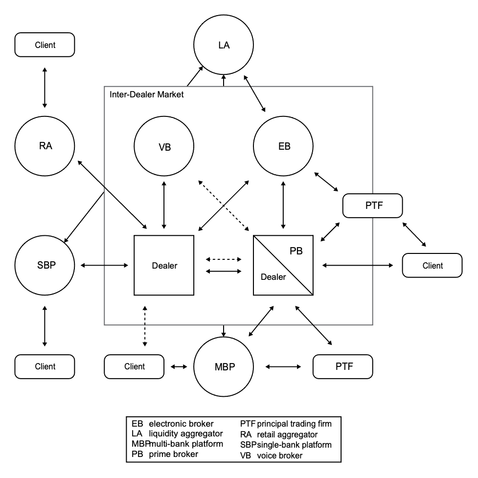

# Current Forex Market

Trust is also the vital ingredient in the formal banking and foreign currency exchange systems. Settlement risk here has the potential to have catastrophic rippling effects throughout the global economy as trillions flow daily through various channels. Many of these transactions are not done through a secure system, such as Onomy or CLS, and are susceptible to disruption if any of the counterparties in the transactions fails to fulfill their obligation after the other party has paid.

The foreign currency market had been described as a partially-decentralized marketplace consists of inter-bank and retail sectors which has presented a challenge to those that wish to navigate or model them. \(Tuyls, Brandlhuber, Delage, & Weiss, 2011\) Large banks make up most of the transactions through trading channels and relationships that the public does not have access to, but with the advent of electronic trading considerable access have been given to many different actors playing a plethora of roles. The major categories of market participants now include asset manages, dealers, central banks, small individual \(retail\) traders, and high-frequency traders.

Because the FX markets are not regulated, there is reduced visibility and an amorphous structure also allows banks to take fees on both sides of retail transactions and control pricing information of trades. Vast inefficiencies in many parts of the world leave retail customers to bear high costs and subpar efficiency due to lack of economic incentive to build out relationships that garner the needed trust and infrastructure that provides accessibility.

Despite these inefficiencies, FX trading has evolved since exchange rates could float in the 1970’s. Initially, the telephone was used to communicate bid and ask quotes in the interdealer market. Squawk boxes, which were multi-party phone lines like today’s conference calls, were introduced to relay buy and sell pricing to multiple parties and are still used today in some emerging markets. With the introduction of electronic trading through the 1980’s and 1990’s, FX trading brought real-time pricing data and increased efficiency to the inter-dealer trade. Electronic trading has also brought FX retail trading to the PCs and laptops of many who otherwise would have been not been able to participate through retail aggregators. Algorithmic trading was introduced concurrently and by some estimates now accounts for one third to a half of all trades. \(King, Osler, & Rime, 2011\)

The number of actors within the FX market has steadily increased as accessibility has increased. The market also has become increasingly fragmented as secondary electronic platforms compete for customers. This fragmentation leads to arbitrage opportunities that high frequency algorithmic trading take advantage of leading to estimates of 30 - 50% of trading volume. The marketplace is split into the inter-dealer market and the customer market although those lines being blurred by the platforms that allow end-users to trade alongside the dealers themselves. Even though there is considerably more access and the market is fragmented, the market is still dominated by only three large dealers.

