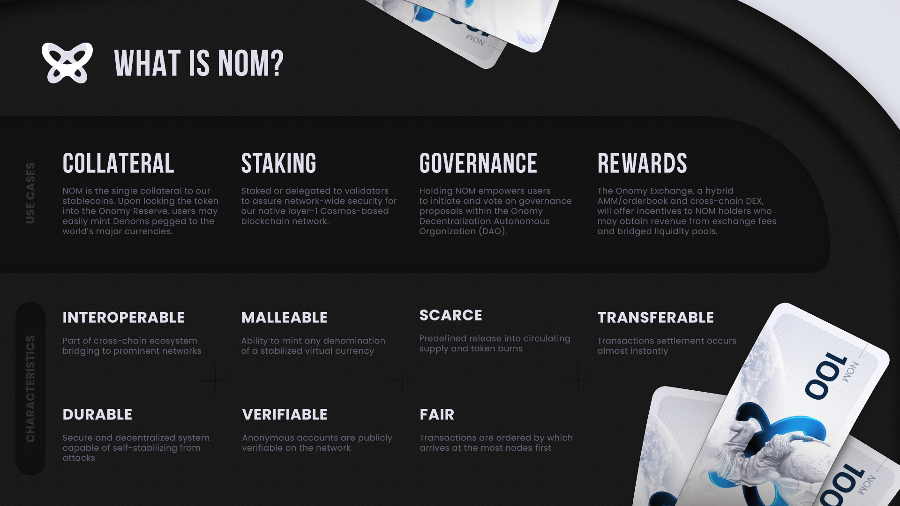

# Overview & Core Pillars

Onomy Protocol is a **layer-1 Cosmos-based blockchain network** powering a **cross-chain orderbook + AMM decentralized exchange (DEX)** and **a stablecoin issuance system** through which users may **easily mint, trade, and lend stable representations of national currencies called Denoms**.&#x20;

Additional products and services, as detailed below, add significant functionality and exposure to liquidity. By merging blockchain technology with traditional finance and providing the fundamental infrastructure for the inclusion of these markets in the digital asset economy, Onomy empowers a level of access otherwise not possible. Furthermore, **Onomy’s core goal is to provide a singular platform from which market participants can enter and exit all digital asset ecosystems**.&#x20;

## :bank: Onomy Core Pillars

Onomy consists of four pillars designed to be a self-governed monetary stabilization system.

* **Onomy Network (ONET):** Layer 1 Blockchain as part of the Cosmos Ecosystem leveraging Tendermint BFT consensus. A decentralized peer-to-peer computational network that processes transactions submitted by users and rewards validators in ONET's native protocol coin NOM. &#x20;
* **Onomy Exchange (ONEX):** A multi-chain decentralized exchange (DEX) that is used to trade cryptocurrencies crosschain. The ONEX experience is that of a traditional orderbook-based exchange, but integrates an Automated Market Maker (AMM) that liquidity providers can commit capital to for a proportional share of the AMM earnings. While ONEX can power trades of all cryptocurrencies, its marketing focus is to be the de facto Foreign Currency Exchange marketplace for stablecoins of major national currencies.
* **Onomy Access**: A non-custodial multi-chain mobile wallet app through which users may manage all assets from supported blockchains. This includes NFT collections and token-specific management features such as governance and staking. Enjoy Single Sign On via QR code, no need for various browser extensions per blockchain to access the DeFi realm.
* **Onomy Reserve (ORES):** governs minting of decentralized stablecoins called Denoms, utilizing NOM as collateral.&#x20;

## :computer: Network

The** Onomy Network **is a Layer 1 blockchain network built on the [Cosmos ecosystem, based on the Tendermint protocol, and plugging into the IBC framework](https://medium.com/onomy-protocol/understanding-cosmos-the-internet-of-blockchains-fc3aa25689a0). Tendermint is the first working proof-of-stake consensus protocol while IBC allows for cross-chain functionality between Cosmos blockchains. **Interoperability is further enhanced with bi-directional bridges** to prominent blockchain networks outside of the Cosmos ecosystem, like Ethereum, Avalanche, Near, and other EVM and non-EVM chains to be announced.

## &#x20;📈 Utility Token

The** native variable asset of the Onomy Protocol is $NOM.** $NOM is used to secure the network through staking and as collateral for the minting of Denoms through the Onomy Reserve (ORES). The Onomy Decentralized Exchange (ONEX) provides Automatic Market Making price discovery used to rebalance collateral ratios of ORES minting accounts.&#x20;

Onomy Protocol will **incentivize $NOM staking with a dual regime inflationary schedule**. The initial hyperbolic hyper-inflationary period, with a peak reward of 100% ARR inflation, is designed to drive network participants to stake and secure the network. $NOM holders will also earn rewards through transaction fees from both the ONEX and the associated bridge liquidity pools.&#x20;

## 🪙 Stablecoins&#x20;

Denoms - crypto-collateralized tokens pegged to the value of national currencies - are minted using NOM tokens at a minimum collateral ratio through the Onomy Reserve (ORES).&#x20;

Block rewards will be available for staking Denoms in addition to NOM, both of which are controlled by the percentage of all coins staked with validators. This control variable is decided by the Onomy DAO and directly impacts supply within the market. Adjustments will incentive staking, minting, or burning of Denoms to balance the monetary system. Please see [Denom Stabalization](../currency-denominations-denoms/denom-stabilization.md) for more details.

## 🗳️ Onomy DAO

DAO (Decentralized Autonomous Organization) is an organization represented by rules encoded as a transparent computer program, controlled by the organization members, and not influenced by a central government. As the rules are embedded into the code, no managers are needed, thus removing any bureaucracy or hierarchy hurdles.

Onomy will be governed by the Onomy DAO**, providing NOM holders with the opportunity to guide the decision-making process through NOM-weighed votes**.&#x20;

### Additional

Onomy has also developed a new consensus algorithm that will provide the required transaction throughput as well as leaderless ordering, addressing validator front running. Future-proofing Onomy as the consensus algorithm becomes battle-tested, audited, and production ready.

##
