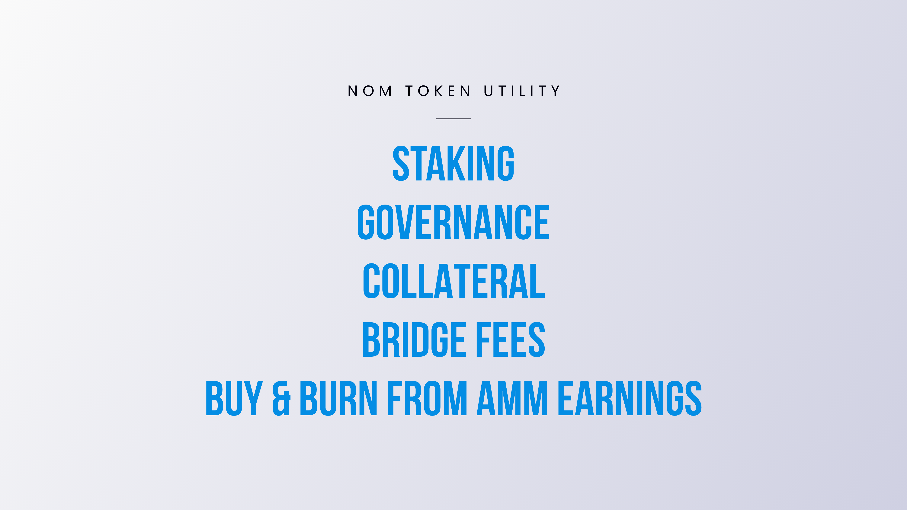

# Utility of NOM

**NOM** is Onomy Protocol's native coin that provides users with significant utility across Onomy Network's ecosystem of applications. View current status below.

## Implemented

### Staking&#x20;

When NOM holders delegate their NOM to a validator, they are _**staking.**_ Staking provides rewards in return for delegating to validators who support the security and operations of a blockchain network. Read more about [NOM staking rewards](../validators-staking/nom-staking-rewards.md)**.**

### Governance&#x20;

Onomy is governed by the Onomy DAO**,** providing NOM holders with the opportunity to guide the decision-making process through NOM-weighed votes. Read more about [Governance](broken-reference).\
\
A DAO (Decentralized Autonomous Organization) is an organization represented by rules encoded as a transparent computer program, controlled by the organization members, and not influenced by a central governing body. As the rules are embedded into the code, no managers are needed, thus removing any bureaucracy or hierarchy hurdles.\
\
There is new functionality integrated into the governance module of the Cosmos SDK. A DAO Wallet has been created to hold the entire protocol treasury of funds, further decentralizing management and enabling NOM token holders to participate meaningfully in not only the direction of Onomy - but its use of funds as well. In doing so, the Onomy Network has a decentralized and "on-chain" Foundation governed by NOM holders.

### Buy & Burn from AMM Earnings

AMM earnings are used in two ways. Firstly, to pay the respective portion of AMM earnings to liquidity providers. Second, to programmatically purchase NOM and then burn the purchased NOM from the supply. This is done with no management by any central party, nor the DAO.\
\
This functionality is incentivized by providing a programmatic reward to any user who executes the buy and burn function - thus decentralizing this action and creating a competitive market amongst users to execute the function to receive the reward.&#x20;

## **NOM Utility Proposals**

_Tracking actively discussed proposals specific to NOM utility (Currently in Discord)_&#x20;

| DRAFTS                      |
| --------------------------- |
| Stablecoin Issuance         |
| Require NOM for Bridge Fees |

