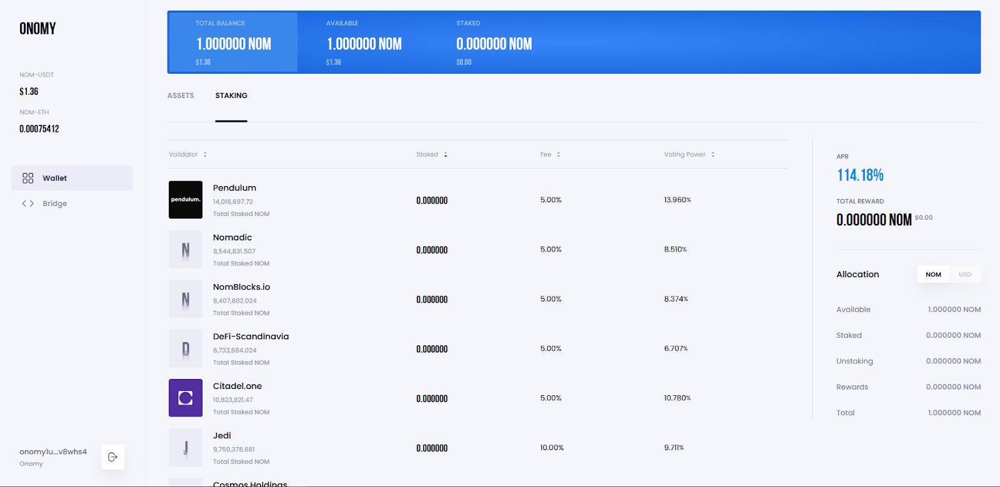
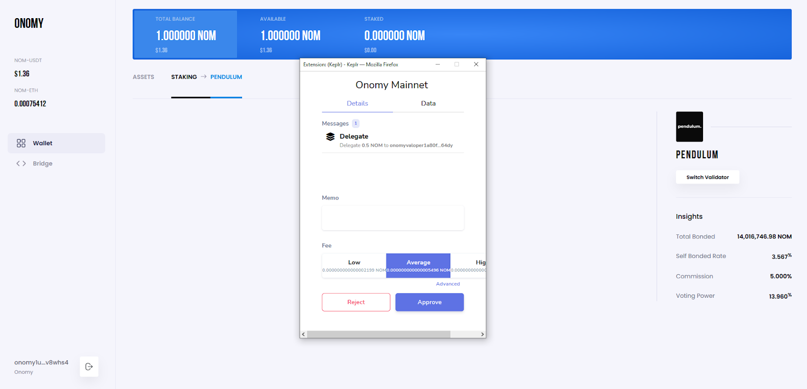
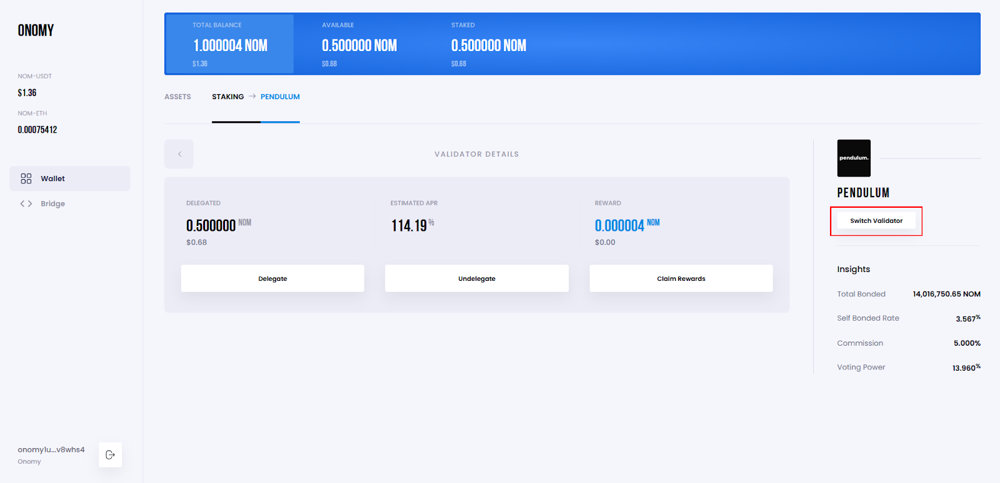
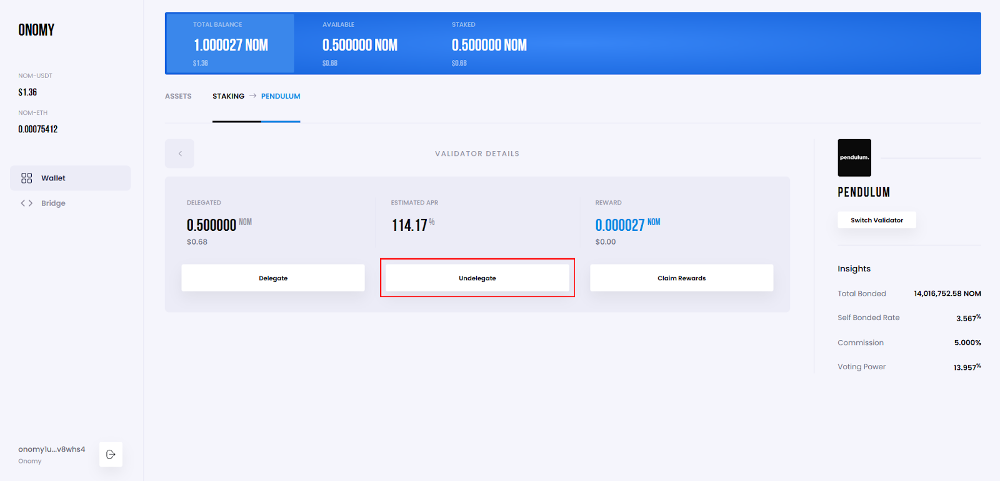
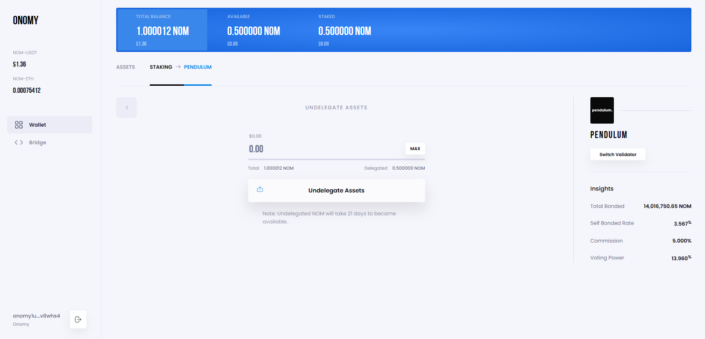

# How to Stake NOM?

New to staking, or just need guidance on how the process works for NOM?

This step-by-step guide will take you through the simple process of delegating your NOM to validators and then getting rewards for securing the network.&#x20;

## Why Stake Your NOM?&#x20;

Onomy Protocol is a Cosmos-based network powered by Tendermint BFT Proof-of-Stake consensus. Validators run nodes which validate the transactions taking place on the Onomy Network. When NOM holders delegate their NOM to a validator they are staking. This helps the validator by increasing their voting weight and also provides delegators with NOM rewards.

Being a delegator is not a passive role, however. Delegators play a critical role in the system, and should remain vigilant when assessing the actions of their validator - it is important to re-delegate if you feel your current validator is not meeting your needs.

Validator weight, voting power and any fees they charge will be listed and this will inform your decision on whether they are right for you.

To learn more about staking, [click here](broken-reference).&#x20;

To understand how staking rewards and network inflation is determined, [click here](nom-staking-rewards.md).&#x20;

## How to Stake NOM

### Step 1: Obtain NOM

Prospective stakers will require NOM before they can stake. The top cryptocurrency exchanges trading NOM include KuCoin, Bitfinex, Bitget, Gate.io, and MEXC. All have natively integrated NOM so you’re able to deposit and withdraw using a Cosmos-based wallet like Keplr, Cosmostation, or Leap Cosmos. You WILL NOT need a memo when sending from an exchange to one of these addresses.&#x20;

Once you hold NOM in any of your wallets, you’re ready to stake.&#x20;

### Step 2 : Add the Onomy Mainnet to your Wallet (Keplr only)

If you are using the Keplr wallet you will first need to add the Onomy Mainnet before you can hold NOM. This is simply done by visiting app.onomy.io, logging in with your Keplr wallet and then using the address provided to withdraw NOM.

If you are using another of the integrated wallets - Cosmostation or Leap - you can skip this step.

### Step 3: Withdraw NOM to Your Integrated Wallet

Withdraw the amount of NOM you wish to stake from the exchange to your integrated wallet - only Cosmostation, Keplr and Leap currently work for this purpose.

### Step 4: Go to app.onomy.io and Connect Your Wallet

Once you are ready, the next step is simply visiting app.onomy.io and choosing the integrated wallet you are using from the options shown.

<figure><figcaption></figcaption></figure>

### Step 5: Choose a Validator to Delegate To

After connecting your wallet you will then be presented with a list of validators to choose from. From the information provided, you must choose which validator you feel will be the most suitable for your needs.

All validators on the Onomy Network are committed to the network via a minimum self-bond of 225K NOM and run infrastructure-level hardware. Some provide additional services in addition to staking, and you may want to research the options provided to make the best choice for your current needs.&#x20;

<figure><figcaption></figcaption></figure>

### Step 6: Enter the Amount to Stake

Once you have chosen your validator you can then decide how much NOM to delegate to them. Simply click the validator you choose, then the ‘Delegate’ option as outlined in the image below.

<figure><figcaption></figcaption></figure>

You can then decide how much NOM you want to stake. When you have done so, then click the ‘Delegate Assets’ button to continue.

<figure><figcaption></figcaption></figure>

### Step 7: Confirm the Transaction

You will then be presented with a pop-up from your wallet where you can approve your transaction.

<figure><figcaption></figcaption></figure>

Once the transaction is confirmed, your stake will be shown next to the validator you have delegated to. Rewards are accrued in real time.

### Step 8: Redelegating/Switching Validator

To switch validators simply navigate to a validator you have delegated to and wish to switch from. Click the ‘Switch Validator’ button as shown in the image below.

<figure><figcaption></figcaption></figure>

You will then be presented with a window that will allow you to choose a new validator and decide how much of your stake you want to transfer. Once you have decided, simply click ‘Approve’ and confirm the transaction via the wallet pop-up that will appear.&#x20;

<figure><figcaption></figcaption></figure>

_Note that you may only do this once every 21 days for the same batch of coins._

### Step 9: Undelegating

To undelegate your stake, navigate to a validator in which you have staked NOM. Choose the ‘Undelegate’ option shown.

<figure><figcaption></figcaption></figure>

Choose how much of your stake you want to undelegate then simply click the ‘Undelegate Assets’ button as shown below when you have done so.

<figure><figcaption></figcaption></figure>

You can then choose to approve the action via the wallet pop-up.

_Note that assets undelegated in this way will take 21 days to become available. Only then will you be able to transfer them out of your wallet, or delegate your NOM once again._&#x20;

#### Are you using Cosmostation Wallet or Leap Cosmos?&#x20;

If so, you are able to stake your NOM natively through these 3rd party apps directly, without having to access app.onomy.io. However, the Onomy desktop superapp beta provides a unified dashboard that contributors are continuously adding new features to.&#x20;

